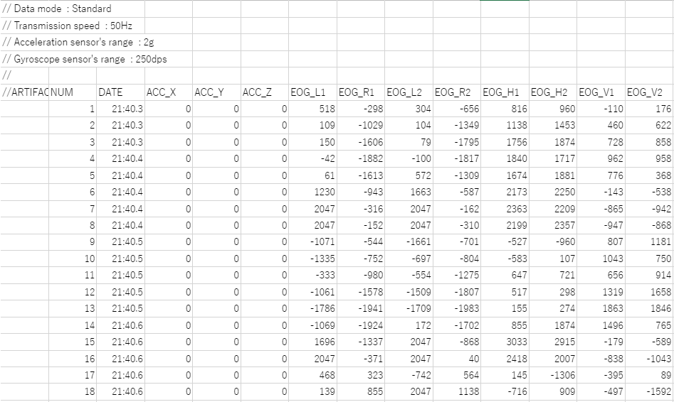
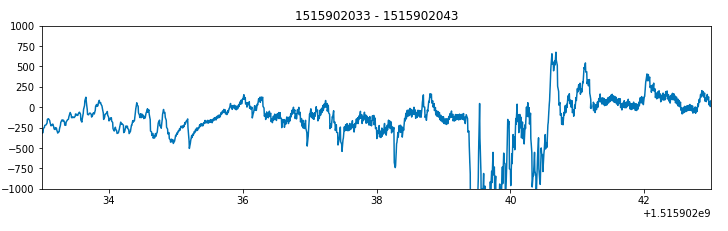
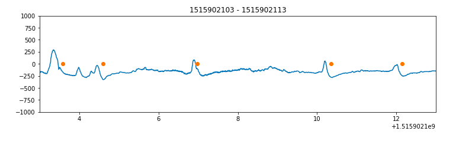

# Jins MEME 
Noise filtration of raw EOG data from JINS MEME
# Raw Data
Raw data stream from Academic version of JINS MEME consists of following parameters given in table below.

# Plotting raw EOG vertical with time

# After filtering

# meme.py
Consists of two functions **Read** and **detect_blink**
### Read
> basically reads the raw data and apply the low pass filter to look the plot more readable.
### detect_blink
> detects the blinks using a fix window iterating over the plot and using fix thresholds shown by a true blink. 

# blink_data.py
This file iterate over all csv's in a given directory and uses the meme.py to read the data and detect blinks and finally make one csv file which gives the blink frequency corresponding to each csv.
